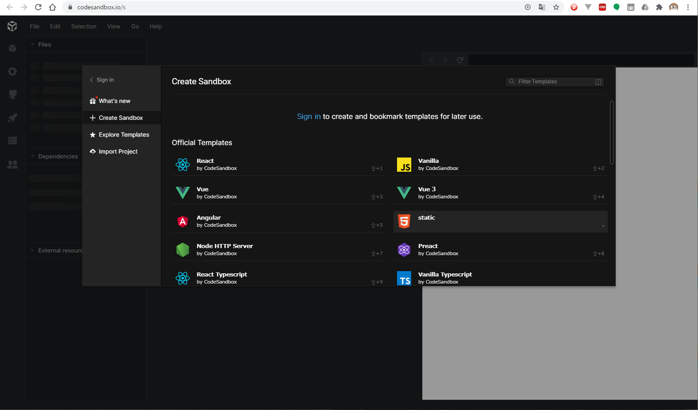

#JavaScript超基礎編

この講座ではJavaScriptの最も基礎的な知識と開発環境の使い方を学びます。

##JavaScriptとは
JavaScriptはWebページでよく使用されるスクリプト言語です。
"コンパイル"という変換処理を行わないで実行される特徴があります。Javaという名前の似たプログラム言語がありますが、全く別の物です。
くわしくは[このページ](https://developer.mozilla.org/ja/docs/Web/JavaScript/About_JavaScript)に記載がありますので、興味があれば読んでみてもよいでしょう。

##開発環境
JavaScriptの開発がすぐにできるオンラインサービスでCodeSandboxというものがあります。
[ここをクリック](https://codesandbox.io/)してページを開くと以下のような画面になります。

##HTML
JavaScriptはWebページで利用されることが多いため、
